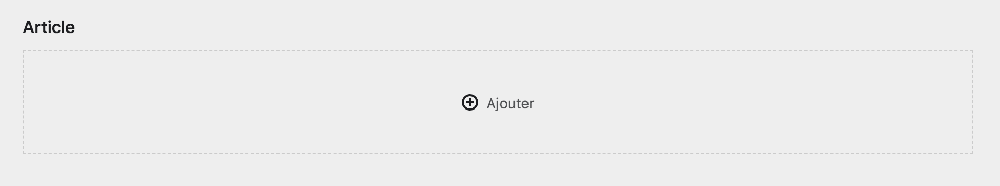
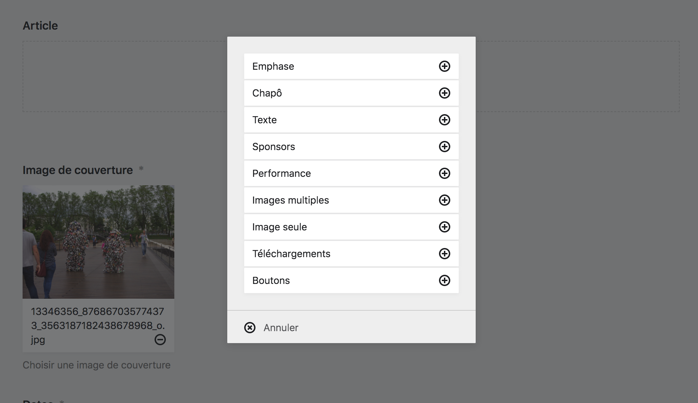
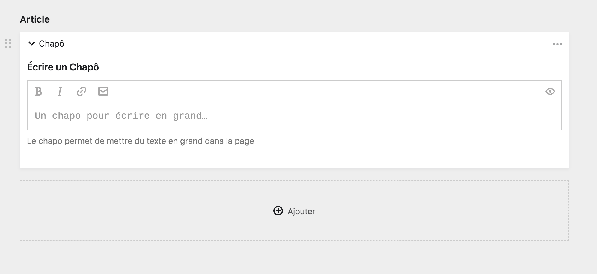
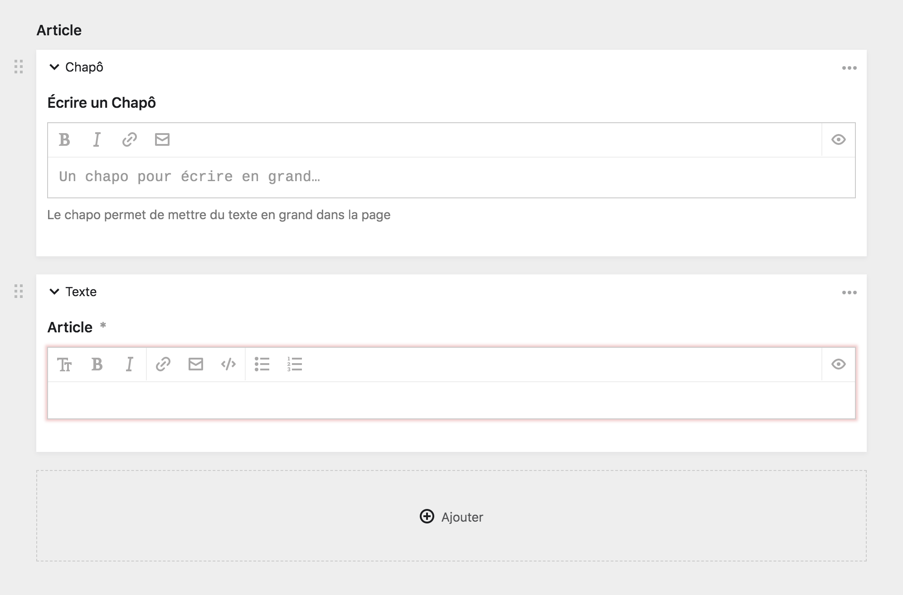
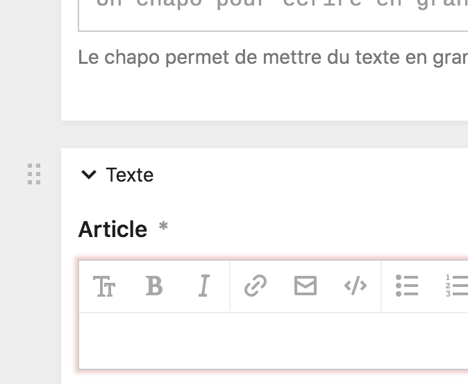
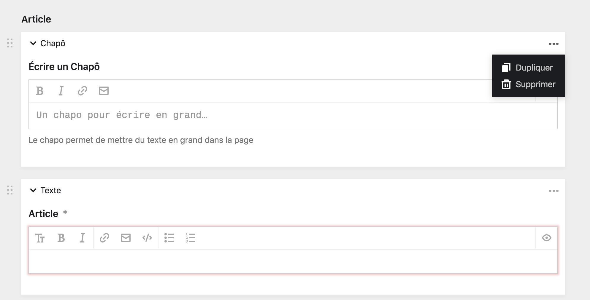
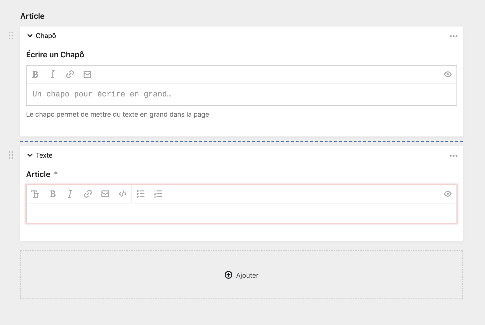

# Fonctionnement de l'éditeur de bloc

L'éditeur de blocs fonctionne comme un **aggrégateur de forumlaires**. Différents types de champs pré-établis sont mis à disposition et vous pouvez choisir parmi l'un ou l'autre bloc, les enchaîner, les déplacer, les supprimer, etc.

Cette section couvre les détails techniques ce concernant pour que vous puissiez passer à la création le plus vite possible. De plus, comme le reste du Panel, l'éditeur de blocs est très intuitif.

## Le bloc vide

De prime abord, vous allez être confronté à une vide, et à un bouton ```+ ajouter``` à partir duquel vous pourrez ajouter votre premier bloc à la page. Au survol, la zone devient bleue.



****

## Ajouter un bloc

Cliquer sur le bouton ```+ ajouter``` fait appraître une boîte modale à partir de laquelle vous pouvez choisir quel bloc vous souhaitez ajouter à la page. Vous pouvez alors selectionner un bloc et cliquez sur le bouton ```+```.

Pour savoir quel type de bloc choisir, rendez-vous sur la page [Différents types de blocs]().



****

## Aspect d'un bloc

Votre premier bloc ajouté, il vous présente un formulaire vide à remplir, similaire à tous les autres formulaires du Panel. En dessous du formulaire, vous retrouvez à nouveau le bouton ```+ ajouter```, qui vous permet d'additionner un nouveau bloc à la page, et ainsi de suite.

Dans l'exemple suivant, un bloc **Chapô** à été ajouté à la page.



Ensuite, un nouveau bloc **Article** à été ajouté en dessous de celui-ci.



****

## Déplacer les blocs

À gauche des blocs, vous retrouvez un bouton ```Déplacer```, composé de six petits carrés grisés. Si vous cliquez dessus, vous pourrez déplacer les blocs les uns au dessus des autres, remontrer ou descendre un bloc, etc.



****

## Options des blocs

À droite des blocs, se trouve le bouton ```…``` des options supplémentaires. Il fait apparaître un menu déroulant avec de nouvelles options pour le bloc.



| Options | Description |
|---------|-------------|
| Dupliquer | Ce bouton vous permet de **créer une copie conforme du bloc** juste en dessous de celui-ci. Utile si vous souhaitez créer des blocs à la chaîne, ou pour reproduire un bloc en particulier |
| Supprimer | Ce bouton vous permet de **supprimer définitivement un bloc**, et d'effacer son contenu. |

****

## Ajouter un bloc entre deux blocs

Si vous passez la souris entre deux blocs, vous verrez apparaître **une ligne pointillée bleue**. C'est une raccourci pour ajouter un nouveau bloc entre deux blocs existants.


