# Différents types de blocs

Cette section détaille tous les blocs que vous pouvez rencontrer dans le panel, et leur équivalent au sein du *front-office*.

Voici les différents blocs existants :
- Des **blocs textuels** comme l'[Article](#bloc-article), l'[Emphase](#bloc-emphase) et le [Chapô](#bloc-chapô).
- Des **blocs médias** comme l'[image seule](#bloc-image-seule) ou les [images multiples](#bloc-images-multiples).
- Des **blocs interactifs** come les [Boutons](#bloc-boutons), la [Performance](#bloc-performance), les [Sponsors](#bloc-sponsors) et le [Téléchargement](#bloc-téléchargement).


## Blocs textuels

### Bloc Chapô

Le **Chapô** est un bloc qui vous permet d'écrire du texte en très grand sur la page. Le texte sera écrit en **Kame Poster**. Il est idéal pour mettre une phrase synthèse en avant et résumer facilement une idée. De plus il apporte du rythme à la page et la rend très dynamique. Des associations qui fonctionnent très bien sont de positionner un ```Chapô``` juste après une ```Emphase``` et avant un ```Article```.

Remarquez également que de mettre du texte **en gras**[^1] dans un Chapô fait passer la typographie que la **Kame Poster Regular** à la **Kame Poster Black**.

Ci-dessous, un bloc Chapô dans le Panel :

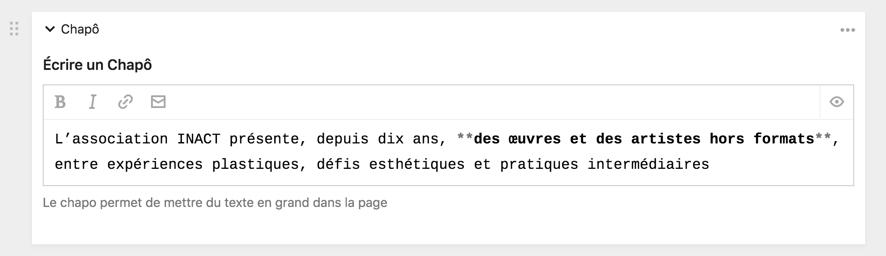

Son équivalent dans le *front-office* :

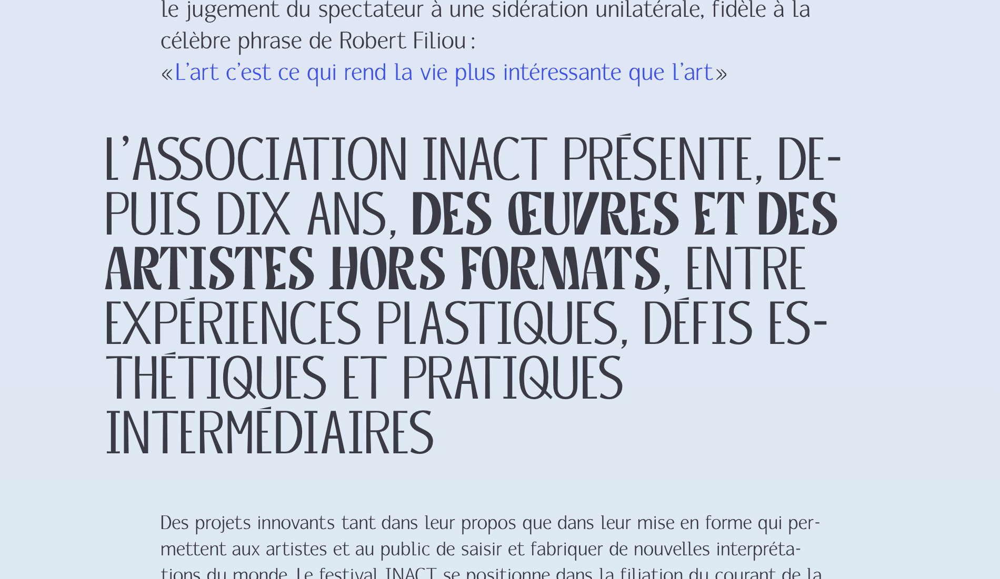

[^1]: Pour en savoir plus sur le balisage, consultez la page sur le [Markdown]().

### Bloc Emphase

**L'Emphase** est un bloc qui vous permet d'écrire du texte **une taille au dessus du texte d'article standard**. Cela vous permet de créer des **introductions** de section ou de page, d'alterner des niveaux hiérarchiques et de marquer plus clairement les **informations importantes** de la page. Une bonne position pour le bloc Emphase est au début d'une page, ou juste après un titre ou une image. Il est généralement suivi d'un bloc Article ou d'un bloc Chapô.

Remarquez également que de mettre du texte **en gras**[^1] dans un bloc Emphase fera changer la couleur du texte en bleu.

Ci-dessous, un bloc Emphase dans le Panel :

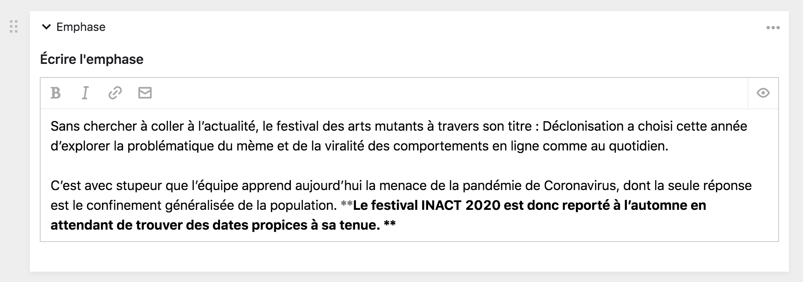

Son équivalent dans le *front-office* :

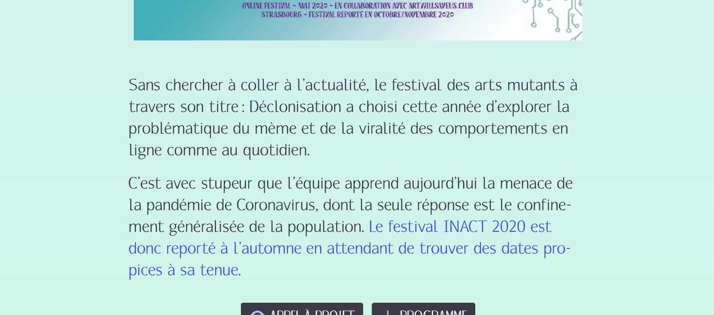


### Bloc Article

**L'Article** est un bloc de base. C'est le plus versatile et celui qui offre le plus de possible de tous. De prime abord, il permet d'écrire du texte en [Markdown](), d'inclure du [contenu dynamique](), de structurer la page, d'intégrer des vidéos, des audios, des images, de mettre des liens, des adresses email, etc.

Ce le bloc qui sera le plus utilisé pour intégrer du contenu au sein du Panel. Tout ce qui est possible de réaliser avec un éditeur classique l'est au sein d'un bloc Article.

Ci-dessous, un bloc Article dans le Panel

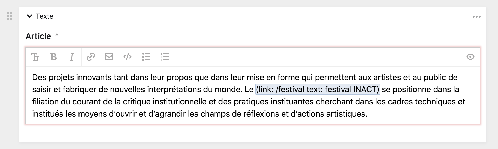

Son équivalent dans le *front-office* :

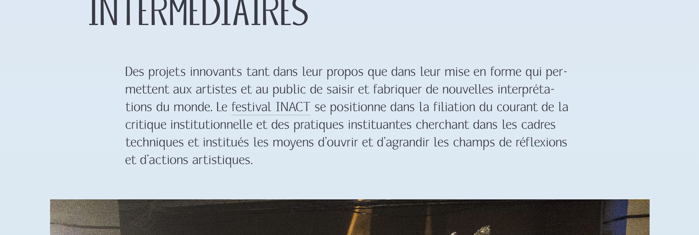

## Blocs médias

### Bloc Image

**L'image seule** vous permet d'intégrer une grande image dans la page, avec une légende et un texte alternatif. Ce bloc est composé de trois champs :
1. Un champ de sélection de fichier [^2] pour choisir l'image à afficher.
2. Un champ de de texte simple pour remplir le texte alternatif [^3] de l'image.
3. Un champ de de texte simple pour remplir la légende [^3] de l'image.

Vous pouvez utiliser le champ d'image seule dès que vous souhaitez insérer une seule illustration dans le site internet.

[^2]: Retrouvez plus d'information sur les fichiers dans la section dédiée de la documentation : [Utiliser les fichiers]().

[^3]: Le texte alternatif et la légende sont des **métadonnées d'un fichier**. Habituellement, elles se remplissent dans la page du fichier, mais sont ici apparentes directement dans la page de contenu. Retrouvez plus d'informations dans la section dédiée de la documentation : [Page de fichier]().

Ci-dessous, un bloc Image seule dans le Panel

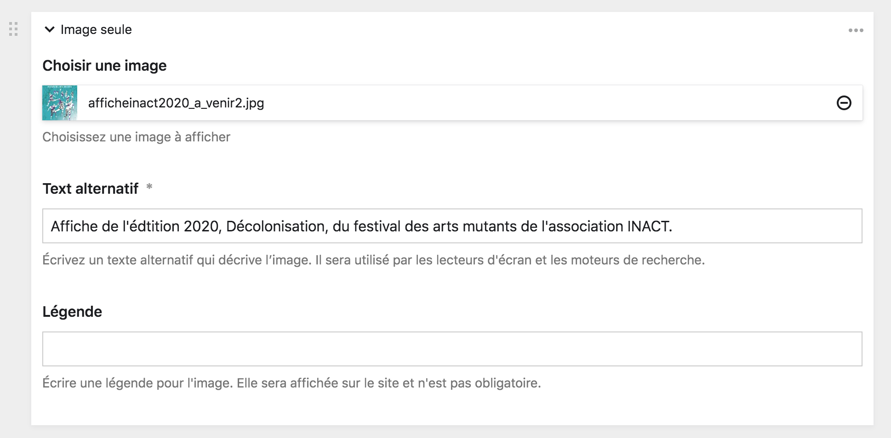

Son équivalent dans le *front-office* :

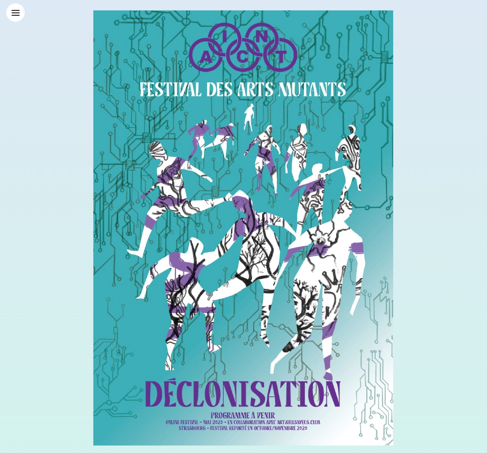

### Bloc Images multiples

Ce bloc vous permet de charger plusieurs images qui apparaîtront les unes à la suite des autres. Il se comporte comme un [Champ de sélection de plusieurs fichiers]().

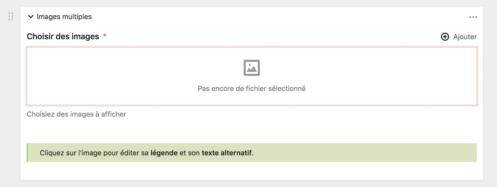

### Bloc Performance

Ce bloc vous permet de **créer une boîte de promotion** d'une performance d'une ancienne édition du festival INACT. Ceci, pour illustrer une page, amener des éléments visuels forts et créer des circulations dans le site internet.

Le bloc se présente comme un formulaire de sélection de page. Cliquez sur le bouton ```+ ajouter``` pour ajouter une performance et sélectionnez celle que vous souhaitez, soit grâce au navigateur de page, soit par la barre de recherche. Vous ne pouvez sélectionner qu'une seule performance par bloc, mais rien ne vous empêche d'enchaîner plusieurs blocs à la suite.

C'est l'image de couverture de la performance qui est choisie pour fonctionner avec le bloc performance.

Le bloc performance vide :

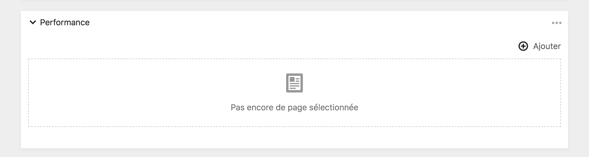

Lorsqu'une performance est sélectionnée, son image de couverture apparaît en grand :

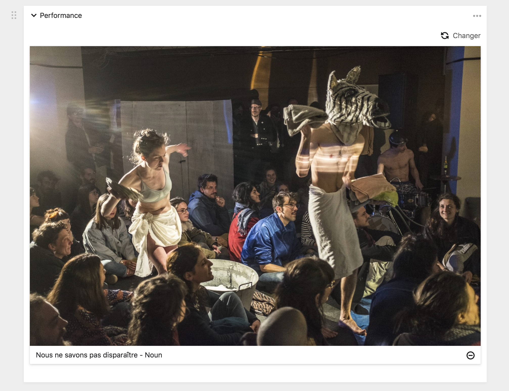

Le bloc performance tel qu'il apparaît dans le *front-office*.

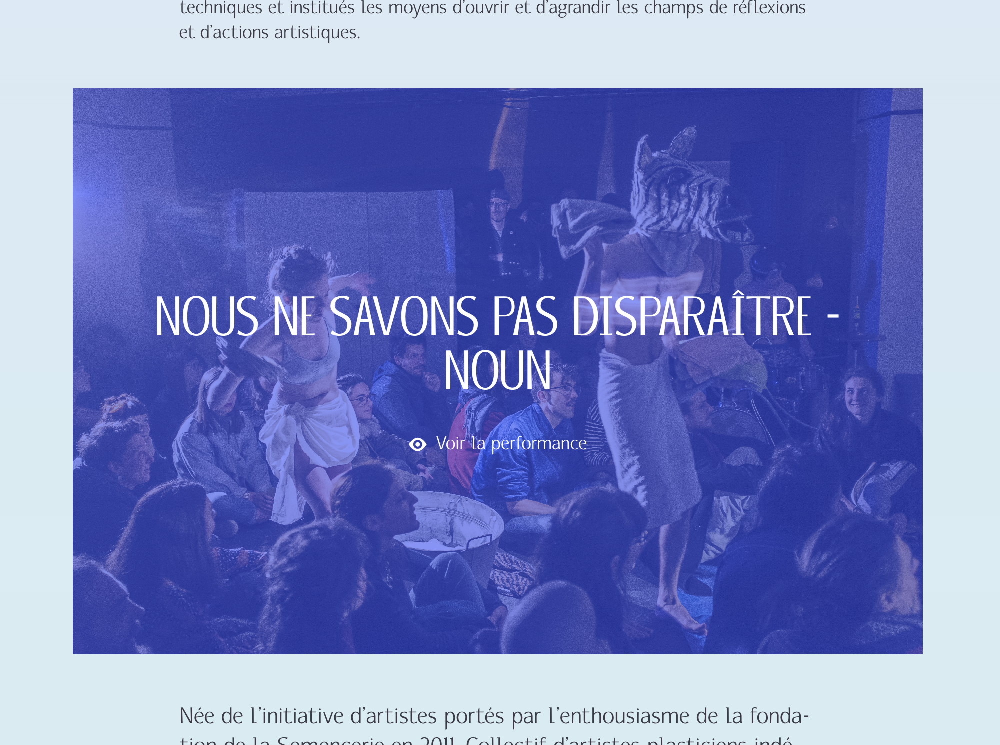

## Blocs interactifs

### Bloc Boutons

Ce bloc vous permet de créer des boutons et de les intégrer sur le site. Les boutons peuvent être des liens amenant vers une page interne du site internet, une page web externe ou un fichier à télécharger. **Le bloc est limité à un maximum de trois boutons**.

Pour ajouter votre premier bouton, cliquez sur ```+ ajouter``` et remplissez le formulaire de création de bouton. Choisiez ensuite le type de votre bouton et remplissez les champ de sélection correspondant au contenu que vous souhaitez relier au bouton.

Ci dessous, le forumlaire de création de bouton :

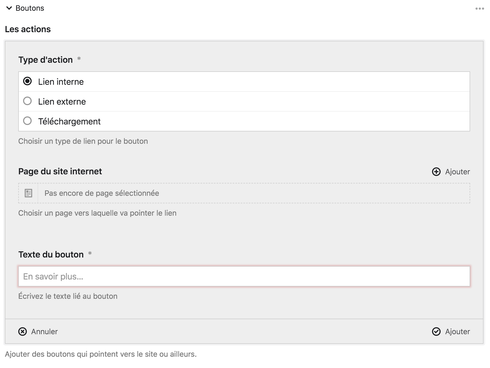

| Type | Description | Icône |
|------|-------------|-------|
| Lien interne | Ce bouton vous permet de pointer vers une page du site internet. Vous pouvez choisir la page précisement grâce à une boîte modale et une barre de recherche. | Œil |
| Lien externe | Ce bouton pointe vers une page externe du site internet. Pour ce faire, vous devez fournir une URL dans le champ correspondant. | Nouvelle page |
| Fichier | Ce bouton vous permet de proposer un fichier au téléchargement. Sélectionnez alors le fichier à télécharger, il doit être importé au sein de la page. | Télécharger |

Lorsque le forumlaire est rempli, les différents boutons se réduisent sous la forme d'un tableau. Cliquez sur la ligne du tableau correspondant au bouton pour modifier son formulaire.

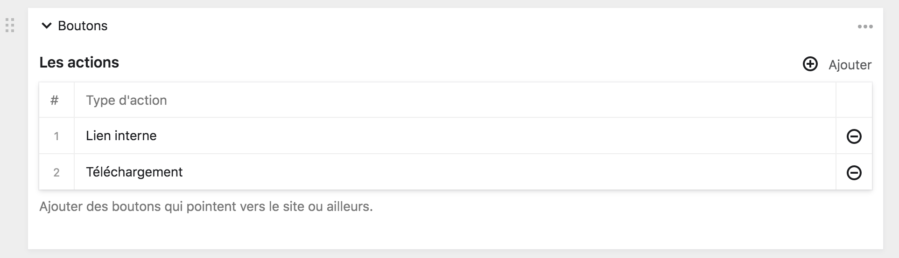

Ici, les trois différents boutons, tels qu'ils apparaissent sur le *front-office*.

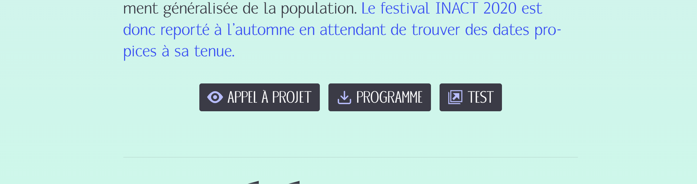

### Bloc Sponsors

Le bloc sponsors vous permet d'afficher une collection des logotypes des sponsors de l'association. Chaque logotype est un lien vers le site du sponsor en question.

Pour ajouter un sponsor, cliquez sur le bouton ```+ ajouter``` et sélectionnez les sponsors que vous souhaitez afficher.

:::note À propos
Ce bloc vous permet uniquement de composer une collection distincte. Pour modifier les logotypes, le titre ou les liens des sponsors, vous devez vous rendre dans la page **Presse**
:::

Le bloc sponsors dans le Panel :
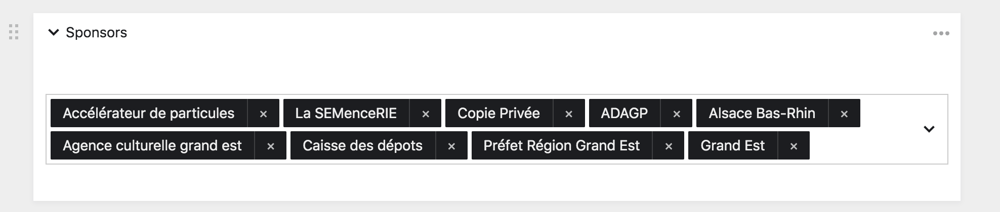

Ce même bloc dans le *front-office* :
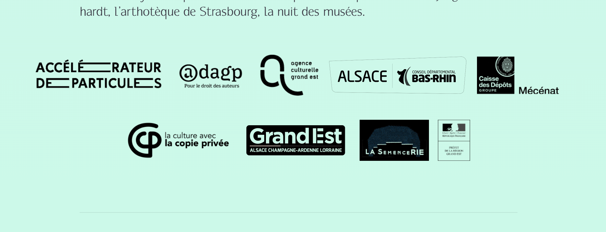

### Bloc Téléchargement

Le bloc téléchargement vous permet de créer une série de bouton de téléchargement de fichier. C'est un équivalent du **bloc Boutons** mais uniquement dédié aux téléchargements. De plus, il vous permet d'activer ou de désactiver l'apparition des boutons sur le *front-office* sans avoir à supprimer le bloc.

Pour ajouter un nouveau fichier à télécharger, cliquez sur le bouton ```+ ajouter```. Vous pourrez alors remplir un formulaire concernant le fichier.

Ici, le bloc Téléchargement vide :

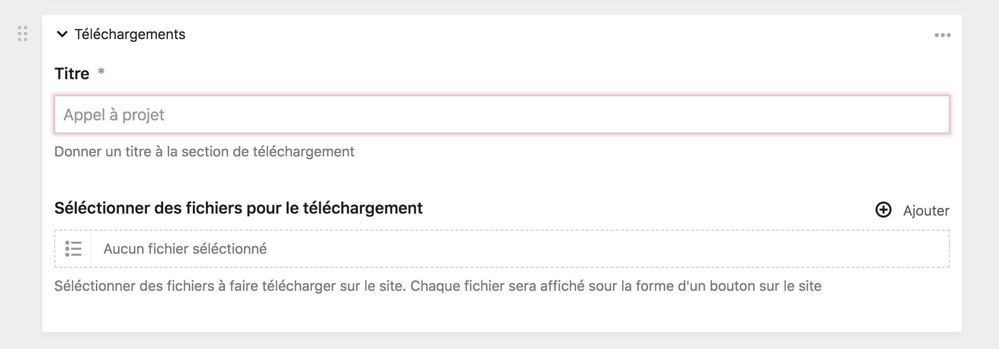

Le formulaire de renseignement pour ajouter un nouveau fichier :

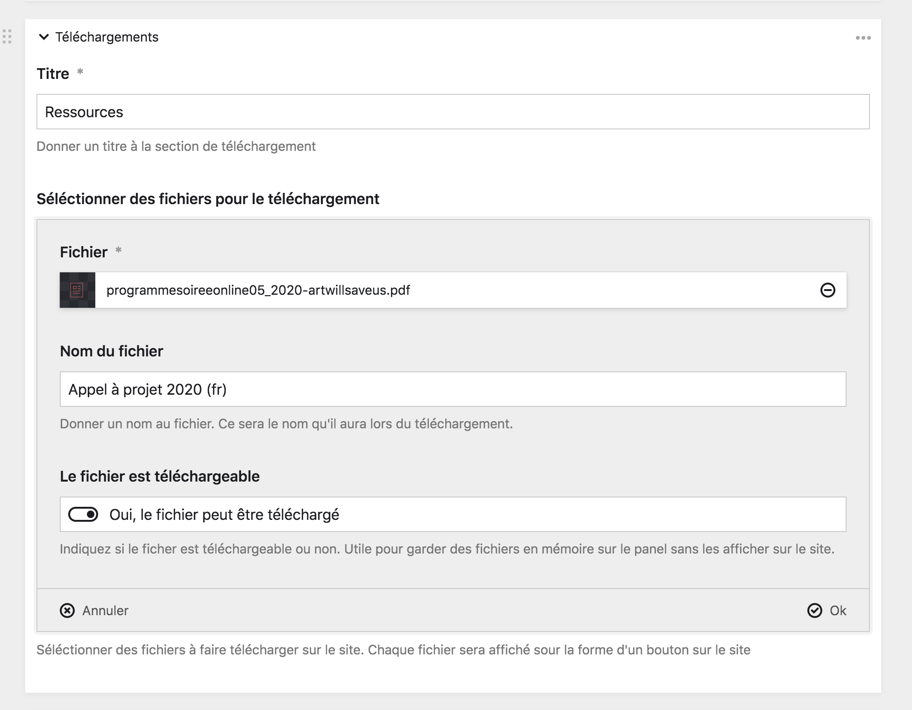

| Champ | Description |
|-------|-------------|
| Fichier | Ce champ vous permet de **sélectionner le fichier**, parmi tout ceux que possède la page, à proposer au téléchargement. |
| Nom du fichier | Vous pouvez ici renseigner le **nom public du fichier**. C'est le nom qui sera donné au fichier lorsqu'il sera téléchargé. |
| Le fichier est téléchargeable | Ce **bouton on/off** vous permet de décider si oui ou non le fichier est affiché sur le *front-office*. |

Le bloc Téléchargement dans le *front-office* :

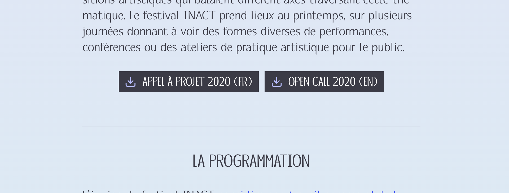
