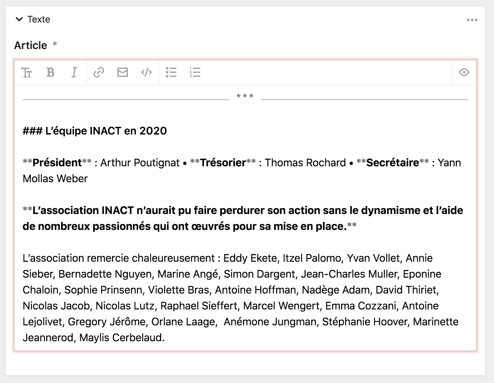
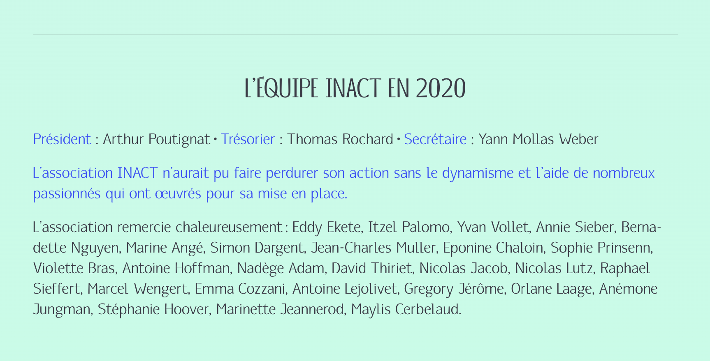

# Le Markdown

Afin de mettre en forme le texte du site internet, le panel utilise le langage de balisage [Markdown](https://fr.wikipedia.org/wiki/Markdown).

Markdown est un langage de balisage léger créé en 2004 par John Gruber avec l'aide d' Aaron Swartz. Son but est d'offrir une syntaxe facile à lire et à écrire, et de pouvoir permettre la lecture d’un texte sans lui donner l’impression d’être formaté par des instructions particulières. Coté [front-office](/technique/panel), le Markdown permet de produire un code HTML simple et efficace pour les articles, en évitant le côté souvent trop verbeux des éditeurs [WYSIWYG](https://fr.wikipedia.org/wiki/What_you_see_is_what_you_get).

Un texte de la page [À propos](https://www.inact.fr/a-propos) au sein de l'éditeur de texte, avec du Markdown, en *back-office* :



Le même texte de la page [À propos](https://www.inact.fr/a-propos), sur le *front-office* :



****

Le Markdown vous permet d’employer les éléments de formatage suivants :

## Texte en gras

Entourez le texte à mettre en gras, soit des symboles ````**````, soit des symboles ```__``` comme dans l’exemple suivant :

``` md
Voici le **Festival des arts mutants**.

Voici le __Festival des arts mutants__.
```

****

## Texte en italique

Entourez le texte à mettre en italique soit du symbole ````*````, soit du symboles ````_````, comme dans les exemples suivant :

``` md
Voici le *Festival des arts mutants*.

Voici le _Festival des arts mutants_.
```

****

## Saut de ligne et paragraphes

Le Markdown convertit automatiquement les **sauts de ligne** et les **paragraphes** présents dans le texte.

``` md
Ma première ligne
Ma seconde ligne

Un autre paragraphe.
```

****

## Ligne horizontale

Pour afficher une ligne horizontale de séparation du texte, utilisez les symboles ```****``` entre deux sauts de paragraphes, par exemple :

``` md
Lorem ipsum dolor sit amet, consectetuer adipiscing elit.

****

Lorem ipsum dolor sit amet, consectetuer adipiscing elit.
```

Vous pouvez également utiliser les symboles ```----``` pour obtenir le même résultat.


``` md
Lorem ipsum dolor sit amet, consectetuer adipiscing elit.

----

Lorem ipsum dolor sit amet, consectetuer adipiscing elit.
```
****

## Titres

Il est possible d’utiliser jusqu’à **six niveau de titres**, du **h1**, le plus grand titre, au **h6**, le plus petit titre.

Pour écrire un titre, placez le symbole ```#``` devant le titre.

Pour augmenter le niveau d’un titre, additionnez les symboles ```#``` :
- Ainsi, un titre h1 aura un seul ```#```
- Un titre h3 aura trois ```###```
- Et un titre h6 aura six ```######```

``` md
# Titre 1
Lorem ipsum dolor sit amet, consectetuer adipiscing elit.

## Titre 2
Lorem ipsum dolor sit amet, consectetuer adipiscing elit.

### Titre 3
Lorem ipsum dolor sit amet, consectetuer adipiscing elit.

#### Titre 4
Lorem ipsum dolor sit amet, consectetuer adipiscing elit.
```

****

## Adresses emails

Vous pouvez insérer une **adresse email cliquable** au sein du texte de plusieurs manières.

Soit vous pouvez entourer une adresse email des symboles ```<``` et ```>```, comme dans l’exemple suivant :

``` md
<contact@inact.fr>
```

Ce qui affichera : <contact@inact.fr>

Pour afficher du texte avec le lien, utilisez le balisage suivant :

``` md
[Envoyez-moi un email](mailto:contact@inact.fr)
```

Ce qui affichera : [Envoyez-moi un email](mailto:contact@inact.fr)

****

## Liens

Vous pouvez insérer un **lien cliquable** au sein du texte de plusieurs manières.

Soit vous pouvez écrire directement l'url, comme dans l’exemple suivant :

``` md
ww.inact.fr
```

Ce qui affichera : www.inact.fr

Si vous souhaitez afficher du texte avec le lien, vous pouvez utilisez la solution suivante :

``` md
[Le site de l’association INACT](www.inact.fr)
```

Ce qui affichera : [Le site de l’association INACT](www.inact.fr)

****

## Listes

Vous pouvez créer des **listes ordonnées** ou des **listes non ordonnées** des manières suivantes

### Liste ordonnées :

``` md
Ma liste :

1. La performance
2. La conférence
3. Les concerts
4. La musique
```

### Liste non ordonnée :

``` md
Ma liste

- La performance
- La conférence
- Les concerts
- La musique
```

Ou alors


``` md
Ma liste

* La performance
* La conférence
* Les concerts
* La musique
```

****

## Citations

Vous pouvez créer des **citations** en plaçant le symbole ```>``` avant chaque début de phrase, comme dans l’exemple suivant :

```md
> L’association INACT présente, depuis dix ans, des oeuvres
> et des artistes hors formats, entre expériences plastiques,
> défis esthétiques et pratiques intermédiaires
```

Ce qui aura le résultat suivant :

> L’association INACT présente, depuis dix ans, des oeuvres et des artistes hors formats, entre expériences plastiques, défis esthétiques et pratiques intermédiaires
