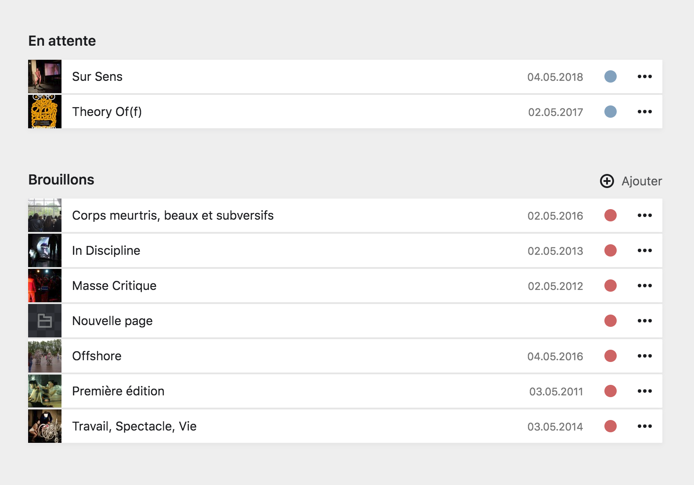
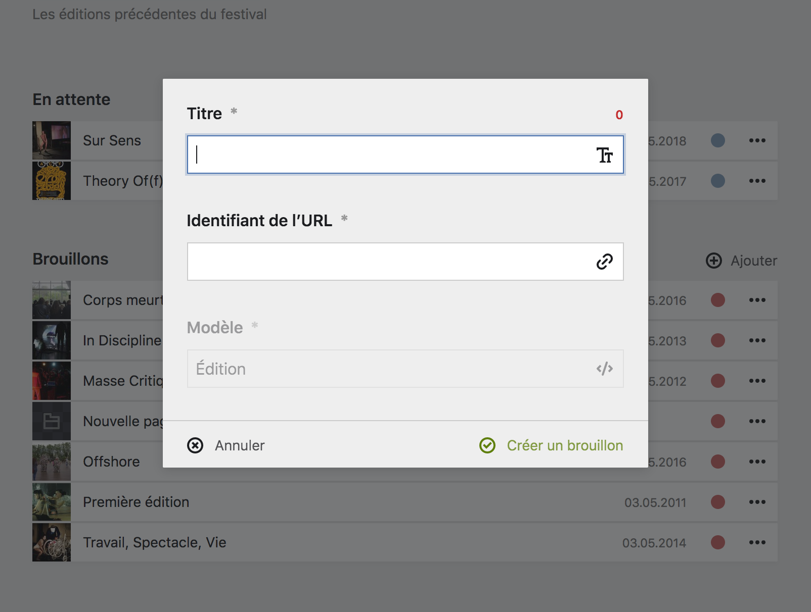

# Créer une page

Pour créer une page, cliquez sur le bouton ```+ ajouter``` dans le coin supérieur droit d'une section de pages.

## Forumlaire de création

**Toutes les nouvelles pages dans le Panel sont crées avec un statut de brouillon**, ceci, pour éviter la publication accidentelle d'une page pas encore prête. Ainsi, la création de nouvelles pages n'est possible que depuis une section **Brouillons**.



Vous devrez alors remplir le formulaire de création de page qui vous demandera deux informations essentielles, obligatoires et fortements liées, qui sont : le **titre de la page**, et son **identifiant**.



Une fois une page créé, vous arriverez sur un modèle vierge de page, qu'il vous faudra remplir avec les informations requises.

****

## Titre et identifiant de la page

| Information | Description |
|--------------|-------------|
| Titre de la page | Le titre d'une page peut être soit son nom commun d'usage, comme ```Contact``` pour la page de contact, ou le titre d'un texte si la page est un article de blog, par exemple ```Mon super article```.
| Identifiant de la page | L'identifiant d'une page va être le texte de réfenrence utilisé dans l'URL de la page. Aussi, il ne doit contenir ni espace, ni caractère spécial. Par défaut, il est créé automatiquement à partir du titre de la page, par exemple : ```contact```. Mais il est également possible de le prersonnaliser, notamment pour créer des URLs courtes et reconnaissable, par exemple : ```super-acticle``` qui donnera ```inact.fr/blog/super-article``` pour le titre ```Mon super article```. |


**Le titre d'une page et son identifiant ne sont lié qu'à la création d'une page**. Si vous changez le titre d'une page a postériori, son identifiant ne sera pas automatiquement mis à jour. Pensez alors à changer l'identifiant en même temps si le changement de titre est conséquent.



**Attention**
Si vous changez l'identifiant d'une page, **pensez bien à vérifier bien que la page n'est pas appellée à un autre endroit du Panel**. Si c'est le cas, mettez à jour l'appel de la page avec le nouvel identifiant, sinon l'appel ne fonctionnera plus.


****

## URL de la page

Pour comprendre le lien entre l'identifiant d'une page et son URL, il faut comprendre comment est composé l'URL.

1. **L'URL indique la position de la page dans la hiérarchie du site**. La racine, ou le site en lui-même est représenté par l'URL : ```www.inact.fr```.
2. Une page de premier niveau, ou positionnée directement à la racine, **vera son identifiant placé juste après l'URL de la racine**. Ainsi ```www.inact.fr/contact``` pour la page Contact, ```www.inact.fr/archives``` pour la page Archives.
3. Une page située à l'intérieur d'une page de premier niveau vera son identifiant ajouté à la suite de celui de sa page parente. Par exemple, l'URL suivante : ```www.inact.fr/archives/l-epaisseur-de-la-transparence``` représente la page **L'épaisseur de la transparence** qui est située au sein de la page **Archive** qui est une page de premier niveau du site.

Dans un autre exemple, si vous créez un dossier nommé ```blog``` comme enfant direct de la racine, cette page sera accessible depuis l'URL ```https:://inact.fr/blog```, etc.

Dans cette logique, le schéma de page suivant :

```
Racine
├── Contact
└── Archives
    ├── L'épaisseur de la transparence
    └── Sur Sens
```


graph LR
  0[Racine]
  1[Contact]
  2[Archives]
  21[L'épaisseur de la transparence]
  22[Sur Sens]
  211[Quantum Enigma]
  212[Mort rêvée]

  0 --- 1
  0 --- 2
  2 --- 21
  2 --- 22
  21 --- 211
  21 --- 212


****

Équivaut à :


graph LR
  0{{www.inact.fr}}
  1{{/contact}}
  2{{/archives}}
  21{{/l-epaisseur-de-la-transparence}}
  22{{/sur-sen}}
  211{{/quantum-enigma}}
  212{{/mort-revee}}

  0 --- 1
  0 --- 2
  2 --- 21
  2 --- 22
  21 --- 211
  21 --- 212


Et ainsi de suite pour toute l'arborescence du site internet.
