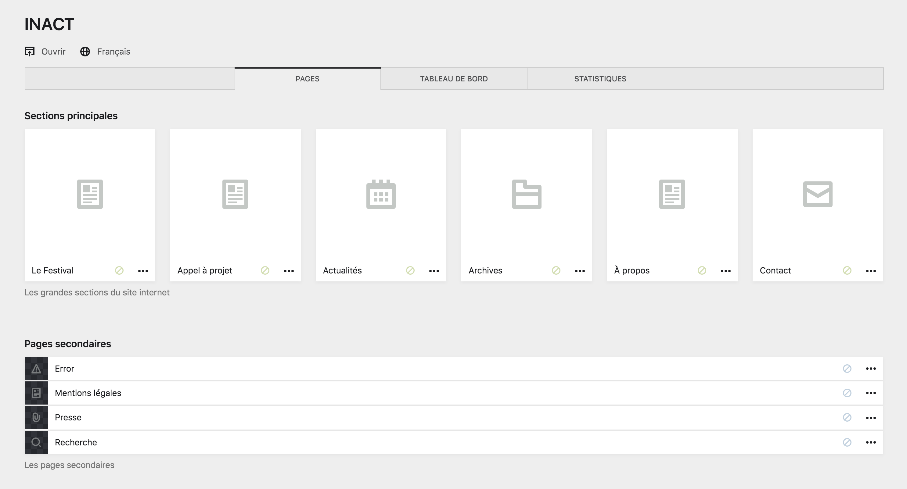
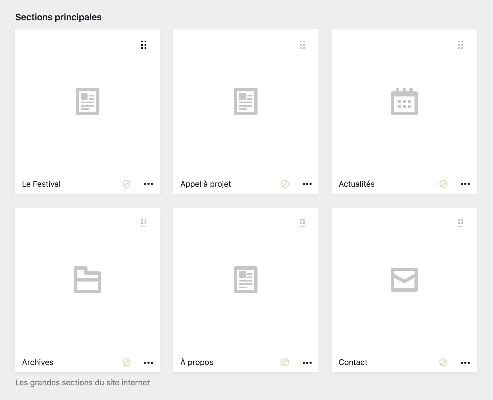
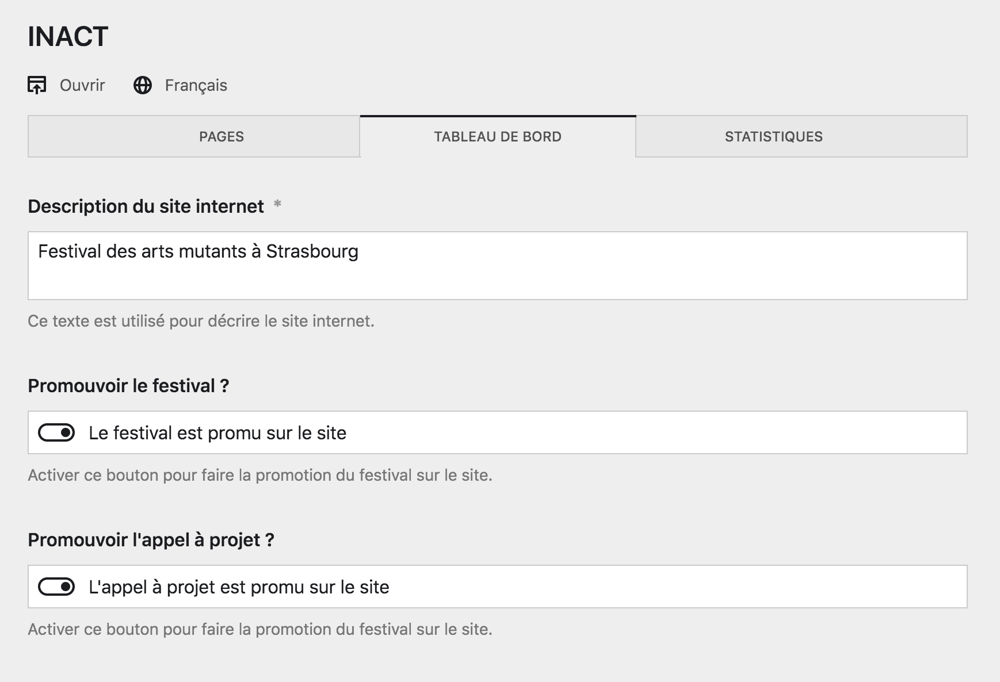
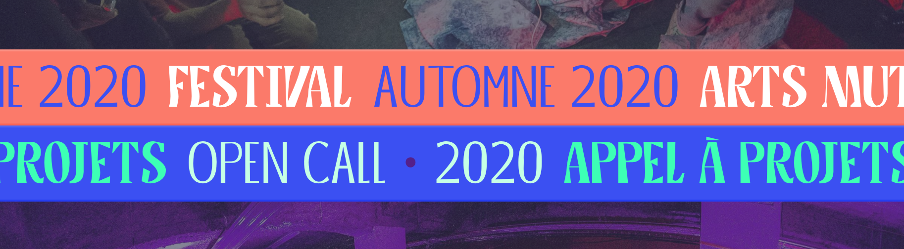
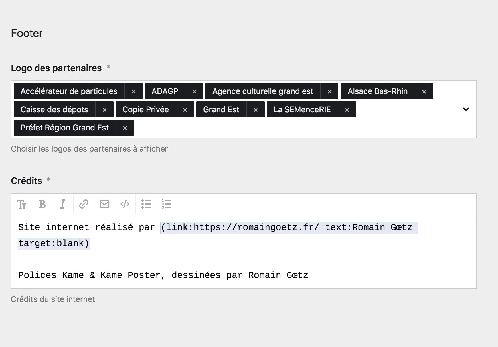
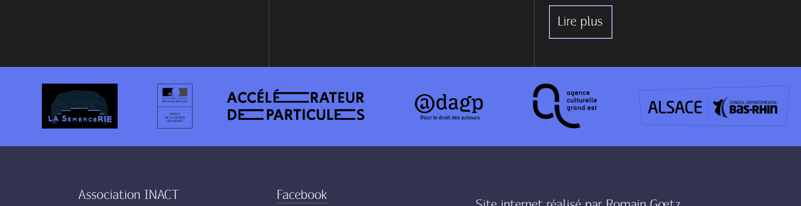
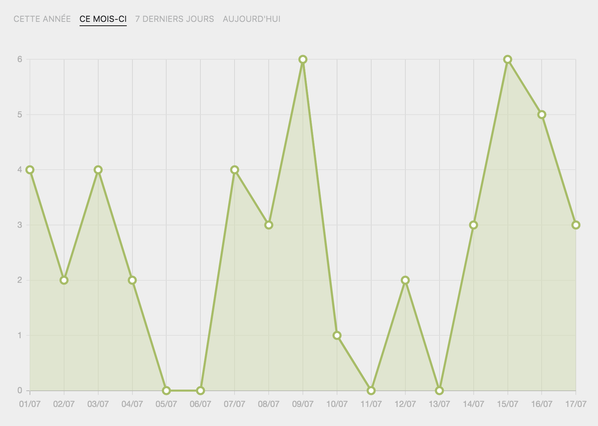
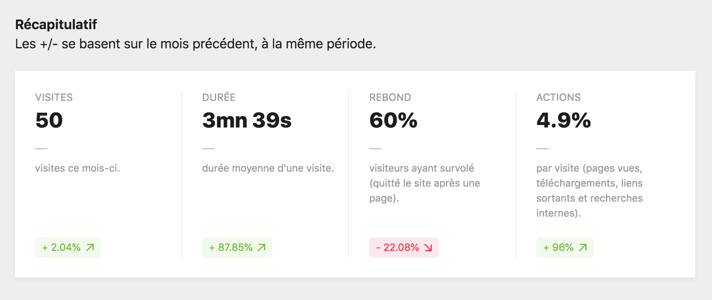

# Accueil du Panel

Le site internet se présente de la façon suivante sur le panel. Pluieurs grandes sections organisent le contenu et vous permettent de travailler à des tâches différentes.

La page est composée de trois onglets principaux :

## Les pages du site

L'onglet des pages présente tout les pages à la racine du site internet. Il est séparé en deux sections distinctes, les pages principales et les pages secondaires.

### Pages princpales

Dans cette section de page, vous retrouvez toutes les pages principales du site internet. Ce sont avant tout des liens pour vous permettre d'accéder au parties importante du site très rapidement.

Les pages principales sont :

| Page | Description |
|------|-------------|
| **Festival** | Vous pouvez modifier le contenu de la page “Festival” et ajouter des événements à partir de cette page. |
| **Appel à projet** | Vous pouvez modifier le contenu de la page et ajouter des fichier à télécharger et des information concernant l'appel à projet d'INACT. |
| **Actualités** | À partir de cette page, vous pouvez créer et modifier les actualités de INACT, comme un micro blog. |
| **Archives** | Cette page contient les archives des anciennes éditions du festival, avec l'ensemble des pages Performances. |
| **À propos** | Cette page concerne directement l'association INACT, vous pouvez en modifier le contenu. |
| **Contact** | Vous pouvez modifier les informations de contact de l'association et du festival à partir de cette page. |

----

## Le tableau de bord

Le tableau de bord comporte le contenu des éléments réccurents du site internet, comme la **description** du site internet, les **boutons de contrôle** d'affichage des bandeaux déroulants, le **footer** et les **crédits**.

### Description du site internet

Dans ce champ, vous pouvez renseigner un texte qui va **décrire le site internet**. Ce sera celui utilisé par la moteurs de recherches, les cartes de partage du site sur les réseaux sociaux, etc.


La description doit être du texte brut, n'employez pas de [Markdown]() ici !


### Promouvoir le festival

Ce bouton *switch* vous contrôle l'affichage du bandeau déroulant liant à la page [Festival](). Activez le bouton pour afficher le bandeau, ou désactivez-le pour masquer le bandeau.

Voici les information fournies par le bouton :
- **Bandeaux actif** : Le festival est promu sur le site
- **Bandeaux inactif** : Le festival est silencieux


Idéalement, un des deux bandeaux doit toujours être actif.


### Promouvoir l'appel à projet

De même que pour le bouton précédent, ce bouton conrôle l'affichage d'un bandeau déroulant. Seulement, cette fois-ci il concerne l'affichage du bandeau *open call / appel à projets*, et fonctionne de la même manière.

Voici les information fournies par le bouton :
- **Bandeaux actif** : L'appel à projet est promu sur le site
- **Bandeaux inactif** : L'appel à projet est silencieux

### Les partenaires

Cette section vous permet de décider **quels partenaires vont être affichés dans le bandeau déroulant des partenaires**, à la fin de chaque page du site. Aussi, sélectionner les partenaires que vous souhaitez afficher et supprimez les autres.


Pour modifier les partenaires en eux-mêmes, rendez-vous sur la page secondaires correspondante : Partenaires.


Voici le bandeau déroulant des partenaires correspondant dans le *front*.

### Les crédits

Ce champ texte vous permet de modifier les crédits en fin de page du site internet. Il n'est normalement pas nécessaire des les modifier.

----

## Les statistiques

Cet onglet vous présente les statistiques d'analyse de visite du site internet, fournie par le logiciel Matomo. Vous y retrouvez plusieurs sections concernant le nombre de visite, la durée, le taux de rebond, etc. Vous pouvez également accéder directement à [Matomo](https://analytics.minuit-collectif.com/) depuis cette page.
