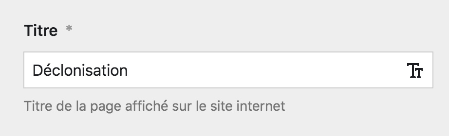

# Le Festival

Cette partie du panel concerne la page [Festival](https://www.inact.fr/festival) du site internet. Vous pouvez en modifier les informations. Elle est composée de trois onglets et de plusieurs parties.


## Contenu

Le contenu rassemble quelques informations fixes de la page, comme son titre, son image de couverture, les dates du festival, sa description, etc.

### Titre

Ce champ textuel vous permet de modifier le titre de l'édition présente du festival. Par exemple, en 2020 : `Décolonisation`.



### Image de couverture

Ce champ vous permet de choisir l'image de couverture de la page. C'est l'image qui est utilisée en page d'accueil et dans les en-têtes partout dans le site internet.



**Attention** : L'image doit être au format **4:3** en **paysage** et faire un minimum de **2000px de large** pour des résultats optimum en *front-office*.


### Dates

Ce champ texte vous permet de changer les dates du festival. Il n'y a pas d'obligation d'écirture ou de formatage, vous pouvez inscrire les dates comme vous le souhaitez.

Les dates sont affichées sur le **bandeau déroulant du festival**, et sur la **page Festival**.


Par exemple, les formats suviants sont valides pour la date :

````
Automne 2020
````

````
16 - 23 mai, 1,2,3 juin 2019
````

````
Du 14 au 22 juillet 2024
````

### Description

Ce champ de zone de texte vous permet de modifier le texte de description du festival qui apparaît en page d'accueil.


N'utilisez pas de Markdown dans ce champ.



### Mots-clefs

Ce champ de tags vous permet de modifier les trois mots qui accompagnent le titre du festival dans la page d'accueil et dans les en-têtes de page. Vous devez obligatoirement choisir trois mots.


### Phrase en alternance

Ce champ de texte vous permet de modifier la phrase affichée en alternance avec les mots clés dans la section festival de la page d'accueil et dans les en-têtes de page. Utilisez une phrase courte et simple pour un meilleur effet !


## Page Blocs

Le reste du contenu de la page est construit grâce aux blocs de pages. Référez à la section de la documentation correspondante pour plus d'informations.

En savoir plus

## Programme
